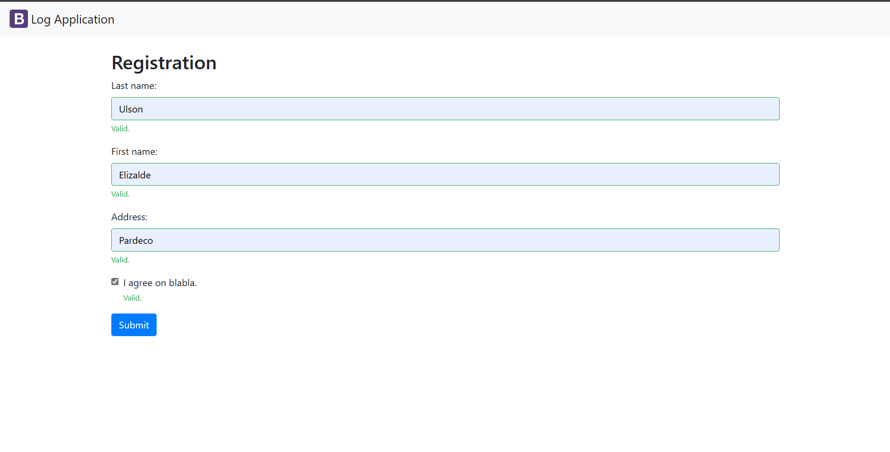

## Elizalde Ulson II

### **LOGAPP** Is A System used to track the employees Logging in and Logging out.

## **INSTALLATION REQUIREMENTS**

**MySQL** - [MySQL Download](https://www.mysql.com/downloads/)

**PHP Language**

**PHPMyADMIN** - [PhpMyAdmin Download](https://www.phpmyadmin.net/downloads/)

## **Procedure on Database edit**

**Step 1** - Open logapp-scaling-octo folder

**Step 2** - Open config folder inside the logapp-scaling-octo folder

**Step 3** - Open db.php using your preferred Editor

**Step 4** - alter the $conn = mysql_connect line of code to match your localhost database

**Step 5** - Save the changes and check if you've successfully added your database to the System.

## Authors 

### **NgtzBogz**

